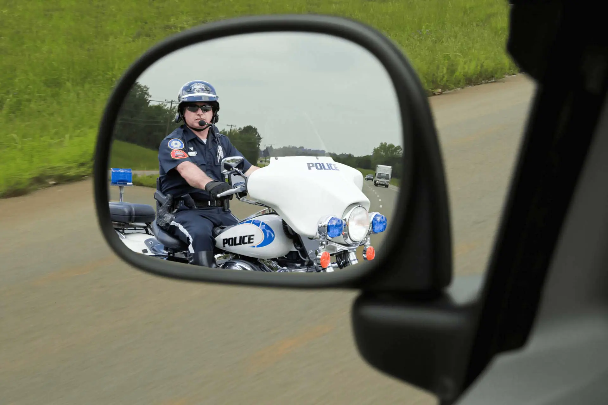
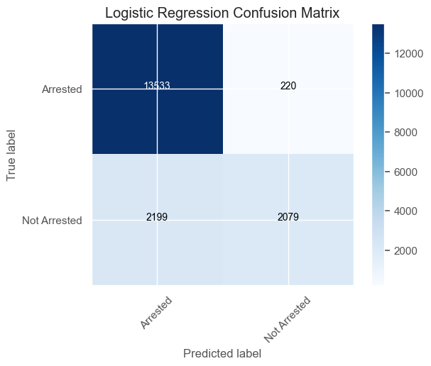
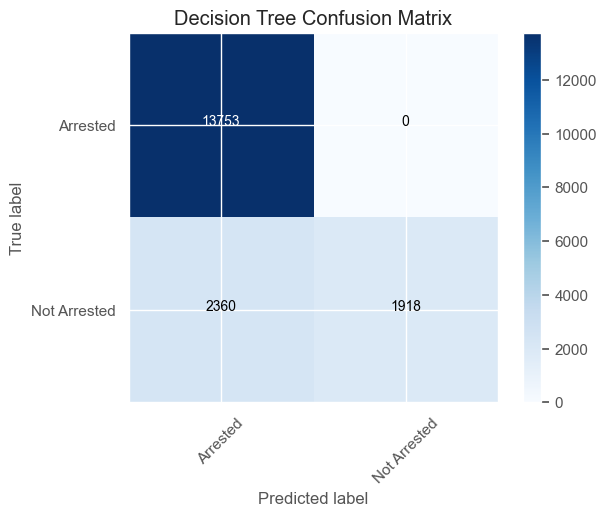
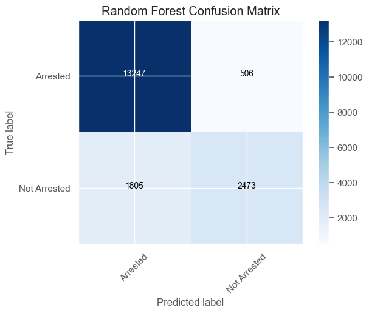
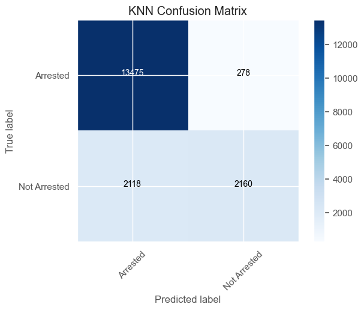

# Traffic Stops & Arrests Prediction Project

## Overview
The primary goal of this project is to leverage a database containing detailed information on Terry Stops conducted by Seattle police officers. The objective is to perform a classification analysis to predict whether an arrest is likely to occur following a Terry Stop. This predictive capability can serve as a valuable tool for police officers, enabling them to better prepare for potential outcomes during a stop based on specific variables present at the time of the stop. Such insights can enhance officer safety, improve decision-making, and foster more effective policing strategies.

file structure

* `your_project_name/`: This is the main directory for your project. Replace it with your actual project name.
* `code_checkpoints/`: This folder stores code at different stages of development.
    * `main/`: This subfolder contains code for visualizations.
    * `models/`: This subfolder contains code for building and manipulating models.
* `Images/`: This folder stores any images used in your project.
* `pdfs/`: This folder can store any project-related PDFs.
* `README.md` (optional): This file provides an overview of your project, including setup instructions and usage information.
* `.gitattributes` (optional): This file helps configure how Git manages specific file types.
* `.gitignore` (optional): This file specifies files or patterns that Git should exclude from version control.
* `.vscode/` (optional): This folder can store settings specific to Visual Studio Code, a popular code editor.

## main

## Business

### Business Understanding
This project is aimed at law enforcement agencies, specifically the Seattle Police Department. The insights derived from this analysis can help officers anticipate the likelihood of an arrest during a Terry Stop, allowing them to adjust their approach and enhance their preparedness. By understanding the factors that influence arrest outcomes, police departments can improve training, decision-making, and overall effectiveness in the field.

In more detail, the project can help in policy formulation and training programs within the police department. By identifying the conditions under which arrests are more likely, the department can tailor its training to better equip officers with the skills and knowledge they need to handle situations appropriately. Additionally, this project can provide a foundation for developing guidelines and protocols that officers can follow to minimize unnecessary escalations and ensure that their actions are justified by the circumstances.

Furthermore, the project holds potential for improving community relations. By making data-driven decisions and demonstrating transparency in their operations, police departments can build trust within the community. Understanding and addressing the factors that lead to arrests can help in reducing perceived biases and ensuring that the stops are conducted fairly and based on solid evidence. This approach aligns with broader goals of community policing, where the emphasis is on building relationships and working collaboratively with community members to enhance public safety.

### Data Understanding
The dataset utilized in this project encompasses a wealth of information on every Terry Stop conducted by Seattle police officers. Key attributes include:

- **Weapon Type**: The type of weapon, if any, that was involved in the stop.
- **Arrest Made**: A binary variable indicating whether an arrest was made as a result of the stop.
- **Reported Date**: The date on which the Terry Stop was reported.
- **Officer Precinct**: The precinct of the officer conducting the stop.
- **Additional Variables**: Other relevant variables that may influence the outcome of the stop.

A Terry Stop, based on 'reasonable suspicion,' allows officers to temporarily detain a person suspected of being involved in criminal activity. The rich detail provided in the dataset enables a comprehensive analysis aimed at understanding the factors that influence the likelihood of an arrest during these stops.

The diversity of the variables included in the dataset allows for a nuanced analysis. For instance, examining the type of weapon involved and its correlation with arrest likelihood can reveal patterns that might not be immediately obvious. Similarly, analyzing the impact of the officer's precinct on arrest outcomes can help identify if certain areas have higher arrest rates due to specific local conditions. This granularity is crucial for creating a robust model that accurately reflects real-world scenarios.

Moreover, the temporal aspect provided by the 'Reported Date' variable allows for the analysis of trends over time. This can uncover seasonal patterns or shifts in policing practices that might influence the likelihood of arrests. Understanding these temporal dynamics is important for developing strategies that are responsive to changes in the environment and that can anticipate future trends.

### Data Preparation
Data cleaning involved handling missing values, correcting inconsistencies, and transforming variables into formats suitable for analysis. This ensured the quality and integrity of the data, making it ready for modeling.

The data preparation phase also included feature engineering, where new variables were created based on existing ones to capture additional information. For instance, combining the 'Reported Date' and 'Officer Precinct' variables could create a new variable indicating the time of day and location of the stop, which might be significant predictors of arrest likelihood. This process enhances the predictive power of the models by providing them with more relevant information.

### Exploratory Data Analysis (EDA)
EDA was conducted to gain an initial understanding of the data. This involved generating summary statistics, visualizing distributions, and identifying patterns or anomalies. Key insights from EDA informed the feature selection and model-building process.

During EDA, various visualization techniques such as histograms, scatter plots, and heatmaps were used to explore relationships between variables. These visualizations help in identifying correlations and trends that are not immediately apparent from the raw data. For instance, a heatmap could reveal that certain combinations of weapon type and officer precinct are associated with higher arrest rates, guiding the feature selection for the modeling phase.

## Evaluation
The performance of each model was evaluated based on the following metrics:

- **Accuracy**: The proportion of correct predictions out of all predictions made.
- **Precision**: The proportion of true positive predictions out of all positive predictions made.
- **Recall**: The proportion of true positive predictions out of all actual positive cases.
- **AUC-ROC**: The Area Under the Receiver Operating Characteristic Curve, which provides a measure of the model's ability to distinguish between classes.

Feature importance analysis was also performed to identify which variables had the most significant impact on the likelihood of an arrest.

Evaluating the models on multiple metrics ensures a comprehensive assessment of their performance. While accuracy provides a general measure of model performance, precision and recall offer insights into how well the model handles imbalanced classes. The AUC-ROC, in particular, is useful for understanding the trade-offs between true positive and false positive rates, helping to select a model that balances sensitivity and specificity.
# Modeling

Various classification algorithms were employed to build predictive models, including:

# Logistic Regression:** A linear model for binary classification.

# Decision Trees:** A non-linear model that splits data based on feature values.

# Random Forests:** An ensemble method that combines multiple decision trees to improve performance.

# KNN Confusion Matrix:** A visualization of confusion matrix for K-Nearest Neighbors (KNN) algorithm.

These models were evaluated and compared to determine their performance in predicting arrest outcomes.

The models were trained and evaluated using metrics such as accuracy, precision, recall, and the Area Under the Receiver Operating Characteristic Curve (AUC-ROC). Hyperparameter tuning was conducted to optimize model performance.

The selection of these models was based on their ability to handle different types of data and their interpretability. Logistic regression, being a linear model, provides clear insights into the influence of individual variables on the outcome. Decision trees and random forests, on the other hand, are better suited for capturing complex interactions between variables. By comparing the performance of these models, we can select the one that offers the best trade-off between accuracy and interpretability.

## Conclusion
This project demonstrates the application of data science techniques to a real-world problem with significant societal implications. By predicting the likelihood of an arrest during a Terry Stop and identifying key influencing factors, this research provides valuable insights that can enhance police officer preparedness and contribute to more effective and informed policing strategies. The structured approach following the OSEMN process ensures a thorough and replicable analysis, paving the way for future research and applications in this area.

After evaluating the performance of four classification models on predicting the outcome of Terry Stops, the Random Forests model emerged as the most accurate, achieving an accuracy of 87.35%. The Decision Tree model followed closely behind with an accuracy of 79.96%, followed by Logistic Regression at 86.92%, and KNN at 86.72%.

Using the Random Forest model, we can predict with 87.19% accuracy whether a Terry Stop will result in an arrest. The most influential factors in this model include the precinct and the presence of an arrest flag. The top five features are:

1. Arrest Flag given
2. Arrest Flag not given
3. Unknown precinct
4. West Precinct
5. Frisk Flag given

### Recommendations:

1. **Training Officers:** Provide training to officers on discerning when it is appropriate to make an arrest during a Terry Stop versus when it might be better to wait, as this is a key indicator of arrests.

2. **Precinct Information:** Ensure the precinct information is accurately recorded for all Terry Stops to better predict the likelihood of an arrest.

3. **Frisk Procedures:** Train officers on the appropriate circumstances for conducting a "frisk," as this is another significant indicator of arrests.

## Future Work
Future work could expand on this project by incorporating additional data sources, such as demographic information or historical crime data, to further refine the predictive model. Collaboration with law enforcement agencies could provide practical insights and facilitate the implementation of these predictive tools in real-world policing scenarios.

Incorporating demographic data could help in understanding the broader social and economic factors that influence arrest outcomes. Historical crime data, on the other hand, could provide context for the Terry Stops, helping to differentiate between stops that are part of routine policing and those that respond to specific crime trends. This additional data could enhance the model's accuracy and provide deeper insights into the factors driving arrest outcomes.

Another avenue for future work is the deployment of the predictive model in a real-world setting. By working closely with law enforcement agencies, we can develop user-friendly tools that integrate the model's predictions into the daily operations of police officers. Pilot programs could be implemented to test the effectiveness of these tools, gather feedback from officers, and refine the models based on their experiences.

Finally, ongoing research and development in this area should focus on ethical considerations and community engagement. Ensuring that the predictive tools are used in a manner that respects civil liberties and promotes transparency is crucial. Engaging with community stakeholders and incorporating their perspectives into the development and deployment of these tools can help in building trust and ensuring that the tools are used responsibly and effectively.

## References
- GitHub repository containing the dataset and analysis: https://github.com/Allan-Kipkemei/Dsc-phase-3-project
- Seattle Police Department Terry Stops Dataset: https://www.kaggle.com/datasets/city-of-seattle/seattle-terry-stops
-

This comprehensive analysis not only addresses the key questions but also provides a solid foundation for improving police practices through data-driven insights. By continuing to refine these models and incorporate new data, we can enhance the effectiveness and safety of law enforcement operations.
